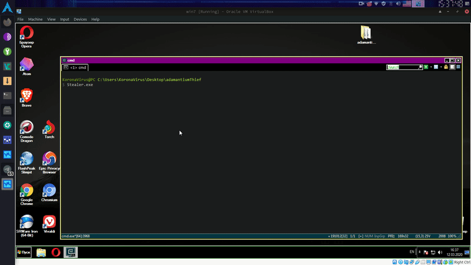
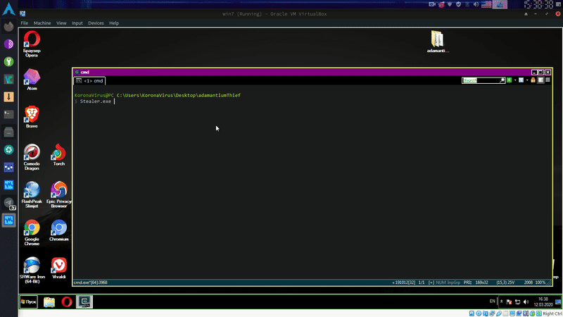

# :unlock: Adamantium-Thief
Get **chromium** based browsers: passwords, credit cards, history, cookies, bookmarks, autofill.  
Chrome 80 > is supported!  
[Need firefox passwords decryptor?](https://github.com/LimerBoy/FireFox-Thief)

# :herb: Examples:  

### :key: Get passwords from browsers:
``` batch
Stealer.exe PASSWORDS
```
<p align="center">
  
</p>

### :credit_card: Get credit cards from browsers:
``` batch
Stealer.exe CREDIT_CARDS
```
<p align="center">
  
</p>

### :clock9: Get history from browsers:
``` batch
Stealer.exe HISTORY
```
<p align="center">
  
</p>

### :bookmark_tabs: Get bookmarks from browsers:
``` batch
Stealer.exe BOOKMARKS
```
<p align="center">
  
</p>

### :cookie: Get cookies from browsers:
``` batch
Stealer.exe COOKIES
```
<p align="center">
  
</p>


# :globe_with_meridians: Browsers list:
* Google Chrome
* Opera
* Chromium
* Brave-Browser
* Epic Privacy Browser
* Amigo
* Vivaldi
* Orbitum
* Atom
* Kometa
* Comodo Dragon
* Torch
* Slimjet
* 360Browser
* Maxthon3
* K-Melon
* Sputnik
* Nichrome
* CocCoc Browser
* Uran
* Chromodo
* Yandex (old)
